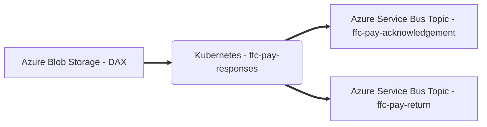

# Pay Responses

Microservice to process payment acknowledgements and return files from Dynamics 365 (DAX)

This service is part of the [Strategic Payment Service](https://github.com/DEFRA/ffc-pay-core).



## Prerequisites
### Software required
- [Azure Service Bus](https://docs.microsoft.com/en-us/azure/service-bus-messaging/)
- [Docker](https://www.docker.com/)
- Either:
  - [Docker Compose](https://docs.docker.com/compose/install/linux/#install-the-plugin-manually)
  - [Docker-Compose (standalone)](https://docs.docker.com/compose/install/other/)

Optional:
- [Kubernetes](https://kubernetes.io/)
- [Helm](https://helm.sh/)

### Configuration
#### Azure Service Bus

This service publishes responses as messages to Azure Service Bus topics.

| Name | Description |
| ---| --- |
| `MESSAGE_QUEUE_HOST` | Azure Service Bus hostname, e.g. `myservicebus.servicebus.windows.net` |
| `MESSAGE_QUEUE_USER` | Azure Service Bus SAS policy name, e.g. `RootManageSharedAccessKey` |
| `MESSAGE_QUEUE_PASSWORD` | Azure Service Bus SAS policy key |
| `MESSAGE_QUEUE_SUFFIX` | Developer initials, optional, will be automatically added to topic names, e.g. `-jw` |
| `ACKNOWLEDGEMENT_TOPIC_ADDRESS` | Azure Service Bus topic name for acknowledgement messages, e.g. `ffc-pay-acknowledgement` |
| `RETURN_TOPIC_ADDRESS` | Azure Service Bus topic name for return messages, e.g. `ffc-pay-return` |
| `EVENT_TOPIC_ADDRESS` | Azure Service Bus topic name for event messages, e.g. `ffc-pay-event` |

##### Message schemas

All message schemas are fully documented in an [AsyncAPI specification](docs/asyncapi.yaml).

#### Azure Storage

This repository polls for files from Azure Blob Storage within a `dax` container.

| Name | Description |
| ---| --- |
| `AZURE_STORAGE_ACCOUNT` | Azure Storage account name |
| `AZURE_STORAGE_USE_CONNECTION_STRING` | Use Azure Storage connection string |
| `AZURE_STORAGE_CREATE_CONTAINERS` | Create Azure Storage containers if don't already exist |

The following directories are automatically created within the `dax` container:

- `inbound` - polling location
- `archive` - successfully processed files
- `quarantine` - unsuccessfully processed files

## Setup
### Configuration

| Name | Description |
| ---| --- |
| `APPINSIGHTS_CLOUDROLE` | Azure App Insights cloud role |
| `APPINSIGHTS_INSTRUMENTATIONKEY` | Azure App Insights instrumentation key |
| `PROCESSING_INTERVAL` | File polling interval in milliseconds, e.g. `5000` |

### Docker

Docker Compose can be used to build the container image.  

```
docker-compose build
```

The service will file watching application and test files so no need to rebuild the container unless a change to an npm package is made.

## Start the service

The service can be run using the [start](./scripts/start) script.

```
./scripts/start
```

This script accepts any Docker Compose [Up](https://docs.docker.com/engine/reference/commandline/compose_up/) argument.

### Debugging

A debugger can be attached to the running application using port `9244`.

## How to get an output

The service will poll for files in the `inbound` directory of the `dax` container.  
The file name must match one of the following patterns:

| File | Pattern |
| ---| --- |
| Acknowledgement | `*Ack.xml` |
| Return | `*Return File*.csv` |

The contents of the file must match the schema for the file type.

### Acknowledgement

The file must be a valid XML file.

Example below for four payment requests with three successful and one failed.

```xml
<?xml version="1.0" encoding="utf-8"?>
<Envelope>
  <Header>
    <FileName>MOCK_0001_AP_20210826105023 (SITI).csv</FileName>
    <Count>4</Count>
    <Succeeded>3</Succeeded>
    <Failed>1</Failed>
    <JournalNum>JN12345678</JournalNum>
    <Posting>N/A</Posting>
    <Validation>PASS</Validation>
  </Header>
  <Lines>
    <Line>
      <SupplierID>1234567890</SupplierID>
      <MessageId>{CF6BCCF9-B7E8-49E2-B78B-5A2D2652BF56}</MessageId>
      <Success>TRUE</Success>
      <Invoice>S123456789A123456V001</Invoice>
    </Line>
    <Line>
      <SupplierID>1234567891</SupplierID>
      <MessageId>{E37B1710-E84A-40D2-BAB2-8AF580512049}</MessageId>
      <Success>TRUE</Success>
      <Invoice>S123456789B123456V001</Invoice>
    </Line>
    <Line>
      <SupplierID>1234567892</SupplierID>
      <MessageId>{62BB6313-4155-475B-A14A-B268AB1DA517}</MessageId>
      <Success>FALSE</Success>
      <Invoice>S123456789C123456V001</Invoice>
      <Log>Journal JN12345678 has been created
Validation failed
Line : 21.
</Log>
    </Line>
    <Line>
      <SupplierID>1234567893</SupplierID>
      <MessageId>{37BD48E3-C94E-4617-8A0F-E9542AF48A82}</MessageId>
      <Success>FALSE</Success>
      <Invoice>S123456789D123456V001</Invoice>
      <Log>Journal JN12345678 has been created
Third-party bank account is invalid!
Third-party bank account is invalid!
Validation failed
Line : 21.
</Log>
    </Line>
  </Lines>
</Envelope>
```

The output will be a message per acknowledgment sent to Azure Service Bus topic, `ffc-pay-acknowledgements`.

### Return

The file must be a valid CSV file.

| Column | Description |
| ---| --- |
| Source System | System payment originated from |
| Invoice number | Reference for payment request |
| FRN | Firm Reference Number |
| Unknown | Always `legacy` |
| Date posted | Date payment was posted to DAX |
| Unknown | Always `S` |
| Value | Total amount settled against invoice |
| Settlement date | Date payment was settled against invoice |
| Settlement reference | Reference for payment settlement |
| Status | `D` equals successful, `E` equals failed |
| Message | Reason for failure, error |

The output will be a message per settlement sent to Azure Service Bus topic, `ffc-pay-returns`.

## Stop the service

The service can be stopped using the [stop](./scripts/stop) script.

```
./scripts/stop
```

The script accepts any Docker Compose [Down](https://docs.docker.com/engine/reference/commandline/compose_down/) argument.

For example, to stop the service and clear all data volumes.

```
./scripts/stop -v
```

## How to test the service

The service can be tested using the [test](./scripts/test) script.

```
./scripts/test
```

The script accepts the following arguments:

- `--watch/-w` - run tests with file watching to support Test Driven Development scenarios (TDD)
- `--debug/-d` - run tests in debug mode.  Same as watch mode but will wait for a debugger to be attached before running tests.

## CI pipeline

This service uses the [FFC CI pipeline](https://github.com/DEFRA/ffc-jenkins-pipeline-library)

## Licence

THIS INFORMATION IS LICENSED UNDER THE CONDITIONS OF THE OPEN GOVERNMENT LICENCE found at:

<http://www.nationalarchives.gov.uk/doc/open-government-licence/version/3>

The following attribution statement MUST be cited in your products and applications when using this information.

> Contains public sector information licensed under the Open Government license v3

### About the licence

The Open Government Licence (OGL) was developed by the Controller of Her Majesty's Stationery Office (HMSO) to enable information providers in the public sector to license the use and re-use of their information under a common open licence.

It is designed to encourage use and re-use of information freely and flexibly, with only a few conditions.
